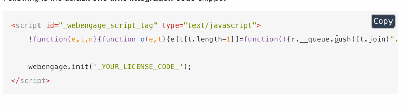

# Плагин Copy Code to Clipboard on GitBook #

[Плагин "Copy Code to Clipboard on GitBook" на gitbook.com](https://plugins.gitbook.com/plugin/copy-code-button)  
[Плагин "Copy Code to Clipboard on GitBook" на github.com](https://github.com/WebEngage/gitbook-plugin-copy-code-button)  

Кнопка "Copy" для блочного выделения икопирования кода

\```language example code block \```

