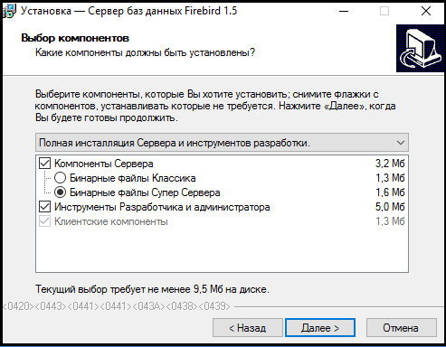

# Инсталяция Firebird #

---

## Рабочее окружение ##

* Операционная система Windows10 (x64)

## Дистрибутив Firebird ##

Для работы с проектом следует использовать последний релиз Firebird 1.5:

* [Firebird-1.5.6.5026-0-Win32](_file/Firebird-1.5.6.5026-0-Win32.exe)
* <a href="/_file/Firebird-1.5.6.5026-0-Win32.exe" download>Firebird-1.5.6.5026-0-Win32</a>
* [Сайт разработчиков](http://www.firebirdsql.org/en/firebird-1-5/)

## Инсталяция ##

Выбор опций при установке:

* Язык инсталяции - русский
* Полная инсталяция Сервера и инструментов разработки

 

* Выбор дополнительных опция

 

## Настройка после инсталяции ##

После инсталяции следует произвести следующие действия (не требуют установки Супер Окон)

* Скопировать библиотеку [swnd6fb.dll](_file/swnd6fb.dll) в папку
  * (Для x64) C:\Program Files (x86)\Firebird\Firebird_1_5\UDF
* Скопировать базы первого и второго отделов
* Прописать в aliases.conf псевдонимы для баз данных

 ```conf
 sw_base = путь/до/базы/данных/первого/отдела
 sw_base_sync = путь/до/базы/данных/второго/отдела
 ```
 Синтаксис:

 ```conf
 dummy = c:\data\dummy.fdb
 ```

Для теста можно сделать buckup/restore database.

