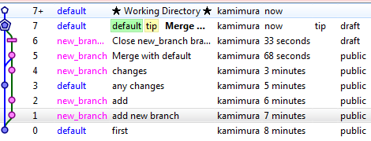

# Правила использования Mercurial #

---

1. Любая разработка или изменение должна производиться только в своей ветке.
1. Именование веток следующим образом: (name_date_featureName) boris_010111_QueryBuilder
1. В "defualt" храниться только версия текущего релиза
1. Если разработка длиться долго то стараться почаще сделать слияние из default в свою ветку,
 т.к. изменения на default могут быть достаточно серьезными и могут вызвать множество конфликтов при дальнейшей разработке.
1. Перед слиянием своих изменений из своей ветке в defualt должно происходить только если разработка закончена и дальнейших 
 изменений вниситься не планируется, очередность **строго такая**:
    1. Сделать pull всеx изменений из default в свою ветку
    1. Разрешить все конфликты если имеются
    1. "Прогнать" и проверить все тесты
    1. Закрыть ветку
    1. сделать слияние (merge) из закрытой ветки в default, также см пункт 6.
    1. Сделать релиз (если необходимо)
1. Обязательно следить за теми файлами которые попадают в default(а также за чистотой своих веток), т.е.
 не нужно добавлять файлы которые автоматически генерируются на стороне пользователя в зависимости от его
 настроек например: *.suo, папки bin, obj в папке с проектами и т.д.

<!-- Добавить описание файла .hqignore -->

Дополнения и изменения преветствуются.