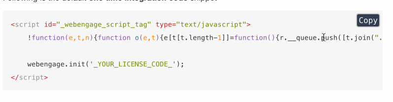

# Инструменты разработки #

---

## IDE ##

Основной среда разработки для языка С#.

* [Среда разработки Visual Studio 2015](https://www.visualstudio.com/ru-ru/downloads/download-visual-studio-vs.aspx)

Среда для разработки документации с разметокой Markdown.

* [Visual Studio Code](https://code.visualstudio.com/Download)

## Компененты ##

Настройка компонентов операционной системы, библиотек, плагинов и среды исполения кода.

### Компоненты Visual Studio 2015 ###

* [Устaновка DDEX Provider for Visual Studio 2015](components/ddex_provider_install/README.md)

### Плагины GitBook ###

 Плагины устанавливаются через Plugin Store на gitbook.com в онлайн редакторе. Функционал привнесенный плагином не будет отображаться в окне preview Visual Studio Code.

* [Плагин GitBook Ace Plugin](components/syntax_highlighting.md) для подсветки синтаксиса кода.

* [Плагин "Copy Code to Clipboard on GitBook" на gitbook.com](https://plugins.gitbook.com/plugin/copy-code-button)  
  [Плагин "Copy Code to Clipboard on GitBook" на github.com](https://github.com/WebEngage/gitbook-plugin-copy-code-button)

 Кнопка "Copy" для блочного выделения кода \``` example code block \```

 

## Система управления версиями ##

* [Настройка GitHub для работы с репозитарием документов](vcs/git_hub_setting.md)

## Тесты ##

* [Запуск Nunit тестов](test_adapter/README.md)