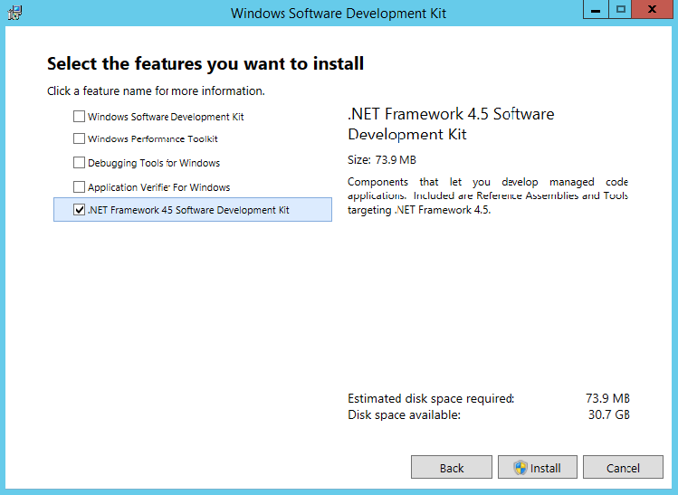
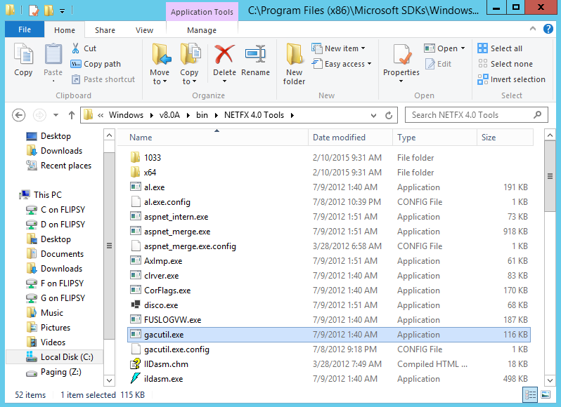

# Gacutil на Windows 10 (x32) #

---

## Рабочее окружение ##

* Операционная система Windows10 (x32)

## Дистрибутив ##

Если на Windows 10 (x32) нет утилиты gacutil то следует скачать пакет Windows Software Development Kit (SDK) for
Windows 8 на [сайте разработчиков](https://developer.microsoft.com/en-us/windows/downloads/windows-8-sdk#Related) или [здесь (web-installer)](_file/sdksetup_4.5.exe).

## Инсталяция ##

1. Опции при инсталяции

 

1. Месторасположение gacutil.exe после инсталяции SDK

 

## Ссылки ##

Написано по мотивам [этой](https://idoneitmyself.com/2015/02/10/where-do-i-get-gacutil-exe/) статьи.