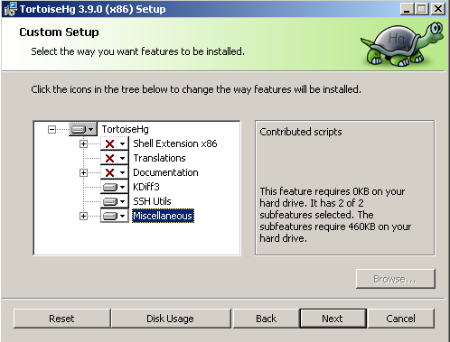

# Настройка агента TeamCity #
---

## Рабочее окружение ##

* Windows 7 (виртуальная машина на Xen 7)

## Настройка ##

1. Установить все обновления (автоматически)
2. Установить агент Team City (инсталятор в админке Team City)
3. Установить MS Build Tool (14 в нашем случае) можно взять [здесь](https://www.microsoft.com/en-us/download/details.aspx?id=48159)
4. Устновить Net Framework 4 (если с обновлениями прилетел более свежий, например 4.6.1, и не дает установить 4 - удалить) (и все обновления)
5. Установить  Windows SDK for Windows 7 and .NET Framework 4 [отсюда](https://www.microsoft.com/en-us/download/confirmation.aspx?id=8442)
6. Прописать в PATH путь до SDK C:\Program Files\Microsoft SDKs\Windows\v7.1\Bin\NETFX 4.0 Tools 
7. Перезагрузка
8. Установить TorstieHQ 
9. Перезапустить службу TeamCity Build Agent
10. Установить Excel (возможно нет)
11. Запустить Fierbird
12. Перенести базы данных 1-го и 2-го отдела и прописать их в alias.conf 