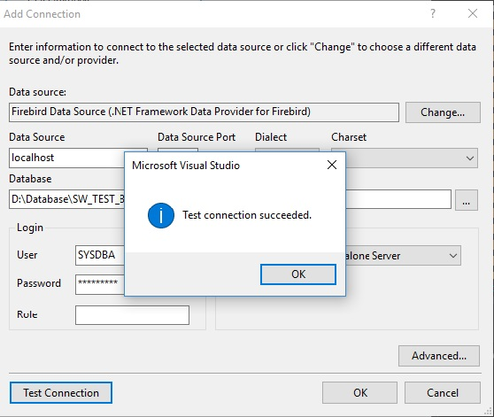

# Устaновка DDEX Provider for Visual Studio
---

### Используемое окружение

* Операционная система Windows(x64)   
* Visual Studio 2015  
* .NET Framework 4.0.

### Подготовка
 
Для установки DDEX Provider необходимо скачать следующие файлы отсюда

* [FirebirdSql.Data.FirebirdClient-4.10.0.0.msi](files/FirebirdSql.Data.FirebirdClient-4.10.0.0.msi)
* [EntityFramework.Firebird-4.10.0.0-NET40.rar](files/EntityFramework.Firebird-4.10.0.0-NET40.rar)
* [DDEXProvider-3.0.2.0.rar](files/DDEXProvider-3.0.2.0.rar)
* [DDEXProvider-3.0.2.0-src.rar](files/DDEXProvider-3.0.2.0-src.rar)

или с официального сайта [firebirdsql.org](http://www.firebirdsql.org/en/additional-downloads/)

### Установка

1. Устанавливаем FirebirdSql.Data.FirebirdClient-4.10.0.0.msi
2. Распаковываем EntityFramework.Firebird-4.10.0.0-NET45.7z в папку с установленным клиентом Firebird.   
**Для Windows10 (x64) это c:\Program Files (x86)\FirebirdClient\** 
3. В переменную %PATH% прописываем путь до утилиты gacutil для .NET Framework 4.0.  
**Для Windows10 (x64) это C:\Program Files (x86)\Microsoft SDKs\Windows\v7.0A\Bin\NETFX 4.0 Tools** 
4. Запускаем командную строку cmd от имени администратора и проверяем что
FirebirdSql.Data.FirebirdClient установлен в GAC

 ```
 Microsoft Windows [Version 10.0.10586]
 (c) Корпорация Майкрософт (Microsoft Corporation), 2015. Все права защищены.

 C:\WINDOWS\system32>chdir "c:\Program Files (x86)\FirebirdClient"

 c:\Program Files (x86)\FirebirdClient>gacutil /l FirebirdSql.Data.FirebirdClient
 Microsoft (R) .NET Global Assembly Cache Utility.  Version 4.0.30319.1
 (c) Корпорация Майкрософт (Microsoft Corporation). Все права защищены.

 В глобальном кэше сборок содержатся следующие сборки:
  FirebirdSql.Data.FirebirdClient, Version=4.10.0.0, Culture=neutral, PublicKeyToken=3750abcc3150b00c, processorArchitecture=MSIL

 Число элементов = 1
 ```

 Если FirebirdSql.Data.FirebirdClient не был установлен в GAC, то сделаем это с помощью команды (**не проверено**)

 ```
 gacutil /i FirebirdSql.Data.FirebirdClient.dll
 ```

5. Теперь установим EntityFramework.Firebird в GAC

 ```
  c:\Program Files (x86)\FirebirdClient>gacutil /i EntityFramework.Firebird.dll
 Microsoft (R) .NET Global Assembly Cache Utility.  Version 4.0.30319.1
 (c) Корпорация Майкрософт (Microsoft Corporation). Все права защищены.

 Сборка успешно добавлена в кэш
 ```
6. Распаковываем DDEXProvider-3.0.2.0.7z в удобную директорию. 
Я распаковал её в c:\Program Files (x86)\

7. Туда же распаковываем DDEXProvider-3.0.2.0-src.7z содержимое поддиректории архива /reg_files/VS2015

8. Открываем файл FirebirdDDEXProvider64.reg с помощью блокнота. Находим строчку, 
которая содержит %path% и меняем его на полный путь к файлу FirebirdSql.VisualStudio.DataTools.dll 
(ветка \[HKEY_CURRENT_USER\Software\Microsoft\VisualStudio\14.0_Config\DataProviders\{92421248-F044-483A-8237-74C7FBC62971}]\)

 ```
 "CodeBase"="C:\\Program Files (x86)\\FirebirdDDEX\\FirebirdSql.VisualStudio.DataTools.dll"
 ```

9. Сохраняем этот файл, запускаем его. На запрос добавить информацию в реестр нажимаем ДА.

10. Теперь нужно отредактировать файл machine.config.    
 **Для Windows10 (x64) он находится по пути C:\Windows\Microsoft.NET\Framework\v4.0.30319\Config**   
 Открываем этот файл блокнотом. Находим секцию   
 
 ```
	<system.data>
		<DbProviderFactories>
		  
		</DbProviderFactories>
	</system.data>
 ```

 И приводим к следующему виду:   

 ```
	<system.data>
		<DbProviderFactories>
		  <add name="FirebirdClient Data Provider" invariant="FirebirdSql.Data.FirebirdClient" description=".NET Framework Data Provider for Firebird" type="FirebirdSql.Data.FirebirdClient.FirebirdClientFactory, FirebirdSql.Data.FirebirdClient, Version=4.10.0.0, Culture=neutral    PublicKeyToken=3750abcc3150b00c"/>
		</DbProviderFactories>
	</system.data>
 ```
 
 То же самое проделаем для machine.config. дирректории Framework64
 **Для Windows10 (x64) он находится по пути c:\Windows\Microsoft.NET\Framework64\v4.0.30319\Config\**
 
 У меня это секция имела следущий вид в обоих файлах (путь добавился автоматически).
 
 ```
 	<system.data>
		<DbProviderFactories>
		<add name="Microsoft SQL Server Compact Data Provider" invariant="System.Data.SqlServerCe.3.5" description=".NET Framework Data Provider for Microsoft SQL Server Compact" type="System.Data.SqlServerCe.SqlCeProviderFactory, System.Data.SqlServerCe, Version=3.5.1.0, Culture=neutral, PublicKeyToken=89845dcd8080cc91"/>
		<add name="Microsoft SQL Server Compact Data Provider 4.0" invariant="System.Data.SqlServerCe.4.0" description=".NET Framework Data Provider for Microsoft SQL Server Compact" type="System.Data.SqlServerCe.SqlCeProviderFactory, System.Data.SqlServerCe, Version=4.0.0.0, Culture=neutral, PublicKeyToken=89845dcd8080cc91"/>
		<add name="FirebirdClient Data Provider" invariant="FirebirdSql.Data.FirebirdClient" description=".NET Framework Data Provider for Firebird" type="FirebirdSql.Data.FirebirdClient.FirebirdClientFactory, FirebirdSql.Data.FirebirdClient, Version=4.10.0.0, Culture=neutral, PublicKeyToken=3750abcc3150b00c"/>
		</DbProviderFactories>
	</system.data>
 ```
11. Для проверки, что всё успешно установилось, запускаем Visual Studio 2015. 
Находим обозреватель серверов и пытаемся подключиться к одной из существующих баз данных Firebird.

 
 
### Материалы
 
Написано по мотивам [этой](https://m.habrahabr.ru/post/278405/) статьи.